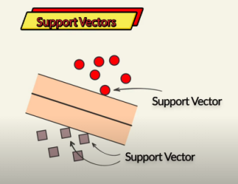

# Comparing SVN and MLP

Comparing **SVM (Support Vector Machine)** with the **Neural Network (MLP) implemented on MNIST**

---

## **1. Model Complexity**

| Feature | **SVM** | **Neural Network (MLP)** |
| --- | --- | --- |
| **Architecture** | Works with a kernel function that finds the optimal hyperplane for classification | Uses multiple layers (input, hidden, output) with learned weights |
| **Feature Engineering** | Requires manual feature engineering | Learns features automatically from raw data |
| **Scalability** | Doesn't scale well to large datasets | Scales well with enough data and computational power |

### **Neural Networks** perform better when feature extraction is necessary (e.g., raw image input). **SVM** can be good for small datasets.

---

## **2. Computational Cost**

| Feature | **SVM** | **Neural Network (MLP)** |
| --- | --- | --- |
| **Training Speed** | Slow for large datasets (O(n²) or worse for kernel SVM) | Faster when using GPU |
| **Memory Usage** | High for large datasets | Requires more memory, especially for deep networks |
| **Inference Speed** | Fast after training | Slightly slower but still efficient |

### **SVM** is efficient for small datasets, but **Neural Networks** are better for large-scale applications.

---

## **3. Training Data Requirements**

| Feature | **SVM** | **Neural Network (MLP)** |
| --- | --- | --- |
| **Small Dataset** | Performs well (< 1000 samples OK) | Struggles without sufficient data |
| **Large Dataset** | Slows down significantly | Performs well with enough data |
| **Overfitting Risk** | Can overfit with non-optimal kernels | Overfits without regularization (dropout, batch norm) |

### **SVM is better for small datasets**, while **Neural Networks excel with large datasets**.

---

## **4. Performance on MNIST**

| Feature | **SVM** | **Neural Network (MLP)** |
| --- | --- | --- |
| **Accuracy** | ~98% with RBF kernel | ~98% (MLP) and even better with CNNs |
| **Preprocessing Needed?** | Requires feature extraction (e.g., PCA, HOG) | No preprocessing needed (raw pixel input works) |
| **Training Time** | Very slow on full MNIST dataset | Faster (with GPU) |

### **Empirical Comparison:**

- **SVM with RBF Kernel**: Achieves **~98% accuracy** but is **computationally expensive** (takes hours without optimized implementation).
- **Neural Network (MLP)**: Achieves **similar accuracy** but is **faster** and scales better.
- **Convolutional Neural Networks (CNNs)**: Can achieve **>99% accuracy** on MNIST, surpassing SVM completely.

---

## **5. Interpretability & Explainability**

| Feature | **SVM** | **Neural Network (MLP)** |
| --- | --- | --- |
| **Interpretability** | Easier to understand with a linear kernel | Harder to interpret due to complex layers |
| **Feature Importance** | Can analyze support vectors and kernel weights | Requires explainability tools (SHAP, Grad-CAM) |

### **SVMs are more interpretable**, while Neural Networks are harder to understand but more powerful.

---

## **6. Summary:**

| Scenario | Best Choice |
| --- | --- |
| **Small dataset (few samples, high-dimensional features)** | **SVM** |
| **Structured/tabular data** | **SVM** |
| **Raw images (no feature engineering)** | **Neural Network** |
| **Scalability to large datasets** | **Neural Network** |
| **Limited computing power (no GPU)** | **SVM** |
| **Real-time applications (fast inference needed)** | **SVM (for small data) / NN (with optimizations)** |

- **Use SVM** if you have a small dataset, want interpretability, and don’t have a GPU.
- **Use Neural Networks (MLP/CNNs)** if you have a large dataset (e.g., MNIST), need scalability, or want to learn features automatically.
