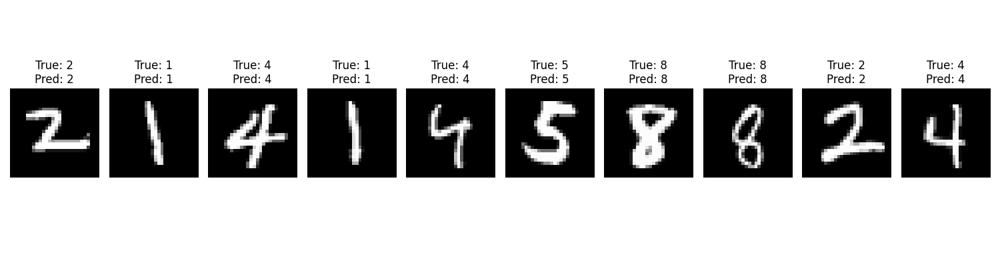

# MNIST SVM Classification Project

This is a classification of MNIST dataset using SVM (scikit-learn) algorithm



## Run project with Docker Compose

1. **Build and run:**

```bash
    docker-compose build
    docker-compose up
```

## comparing with NN pytorch

## **Точность**

| **SVM** | **Neural Network (MLP)** |
| --- | --- |
| При использовании RBF-ядра и корректной настройки гиперпараметров SVM может достичь точности около 95%. | Простой MLP на MNIST может показывать точность порядка 97–98%, сопоставимую с SVM. |

## **2. Время обучения**

| **SVM** | **Neural Network (MLP)** |
| --- | --- |
| Обучение SVM с RBF-ядром на полном наборе данных MNIST (60 000 изображений) может быть очень ресурсоемким, так как алгоритм имеет высокую вычислительную сложность O(n²) или O(n³) | Нейронные сети, особенно при использовании GPU, обучаются значительно быстрее на больших наборах данных. |
| В реальных задачах лучше использовать подвыборки данных для обучения SVM, чтобы снизить время вычислений | Параллельные вычисления на GPU позволяют эффективно обрабатывать большие батчи, что существенно ускоряет обучение |

---

## **3. Время инференса**

| **SVM** | **Neural Network (MLP)** |
| --- | --- |
| Может быть сравнительно медленным, если модель содержит большое число опорных векторов, поскольку для каждого нового примера требуется вычисление ядровых функций для всех опорных векторов. | Выполняется очень быстро, особенно при использовании оптимизированных библиотек на GPU. |
| Это может стать узким местом в приложениях, где требуется обработка большого количества входных данных в реальном времени. | Процесс инференса сводится к последовательным матричным умножениям, что позволяет обрабатывать данные в режиме реального времени даже при высоких объемах запросов. |

## **6. Вывод:**

- **Точность** Обе модели могут достигать высокой точности на MNIST. SVM может показать около 98%, а современные нейронные сети, способны превзойти 99%.
- **Время обучения** Нейронные сети обучаются быстрее на больших наборах данных при наличии GPU, тогда как SVM может требовать существенно больше времени из-за вычислительной сложности.
- **Время инференса** Нейронные сети обеспечивают более быстрый инференс, что делает их предпочтительными для реальных приложений с высокой нагрузкой, в то время как SVM может быть менее эффективен при большом количестве входных данных.
